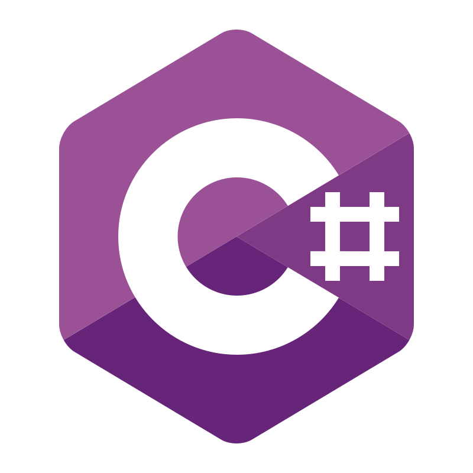
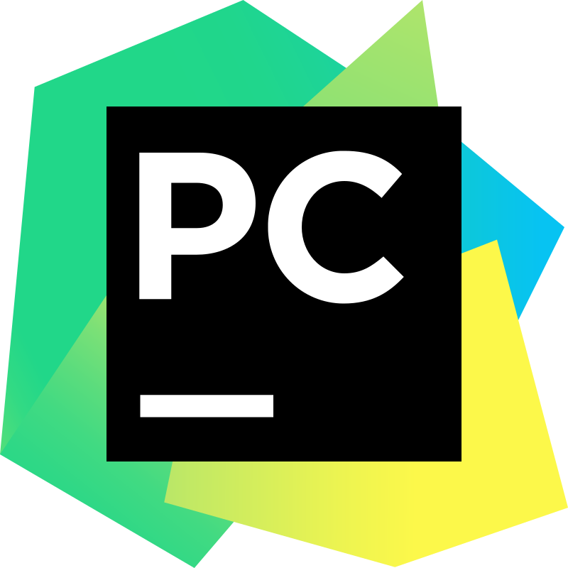

<h3 align="center">“Any sufficiently advanced technology is indistinguishable from magic.” — Arthur C. Clarke</h3>

<h2 align="center">Backend</h2>

  &nbsp;
  &nbsp;
  &nbsp;
  

<h2 align="center">Frontend</h2>

  &nbsp;
   &nbsp;
  &nbsp;
  

<h2 align="center">Sistemas de gestión de bases de datos | Database management systems</h2>

  &nbsp;
   &nbsp;
  &nbsp;
  

<h2 align="center">Sistemas operativos y distribuciones | Operating Systems and distributions</h2>

  &nbsp;
   &nbsp;
  &nbsp;
  

<h2 align="center">Entornos de desarrollo integrados | Integrated development environment</h2>

  &nbsp;
   &nbsp;
  &nbsp;
  &nbsp;
  &nbsp;
  

<h2 align="center">Servidores y herramientas | Servers and tools</h2>

   &nbsp;
  &nbsp;
   &nbsp;
  &nbsp;
  &nbsp;
  &nbsp;
  &nbsp;
  

